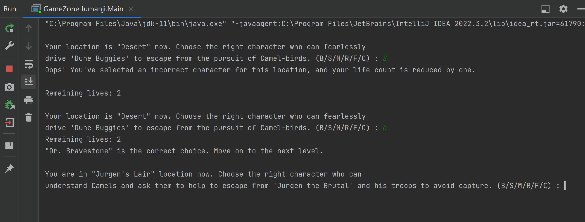

<h1 style="text-align: center"> Jumanji Game</h1>
This is a text-based adventure game written in Java. To advance through the levels, players must navigate through various locations and make character choices.

## Overview
The point of the game is to make it out alive at the end of each level. Players must select the appropriate character for each level, which represents a different location. If the wrong one is picked, the player will lose a life. When all lives have been utilized or the player has completed all levels, the game ends.

1. At each level, the player is presented with a **location** prompt and must choose the correct character to progress.
2. In each session, a `random` location is **automatically** selected from the first 3 locations. The program then proceeds with the remaining locations in sequence.
2. The player's **character choice** is validated against the correct character for that location.
3. If the character choice is correct, the player moves on to the next level.
4. If the character choice is incorrect, the player loses a life and must try again.
5. At the final level, you will be prompted to select 2 characters to successfully complete the game and achieve victory.


## Getting Started
- Clone the repository or download the source code. 
- Open the project in your Java development environment.
- Compile and run the `Main` class to start the game.
- Or you can run the program through terminal:
```bash
$ javac Main.java

$ java Main 
```


## Controls
At each level, the player is prompted to enter a character choice. You have to enter the corresponding character code for the desired character choice:

#### Character Codes
- B: Dr. Bravestone
- S: Prof. Shelly
- M: Franklin Mouse
- R: Ruby Roundhouse
- F: Ming Fleetfoot
- C: Cyclone

#### Game Flow Example:




## Dependencies
The game has no external dependencies.


## Contributing
Contributions to the Jumanji project are greatly appreciated! Please feel free to share your comments if you find any bugs, issues, or have suggestions for improvements.